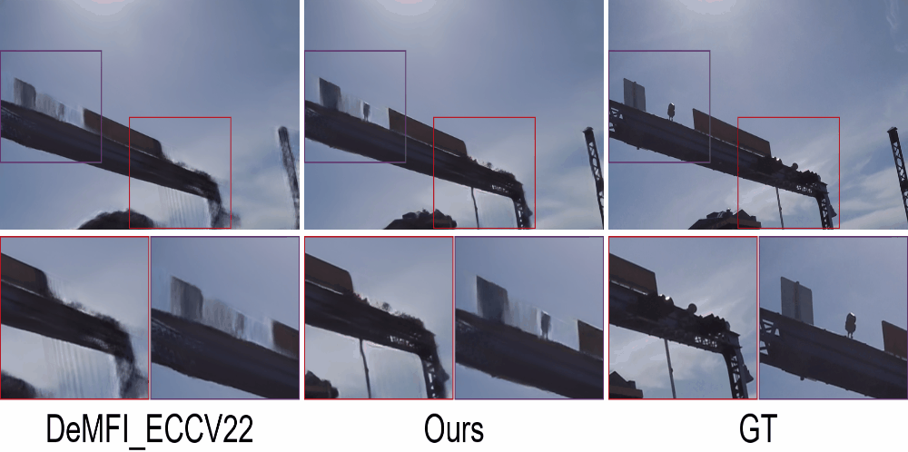
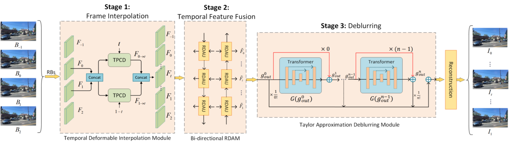

# Three-Stage Cascade Framework for Blurry Video Frame Interpolation (ICCV-4845)

##  Examples of the Demo (x8 Multi-Frame Interpolation) videos (240fps) interpolated from blurry videos (30fps)
<table>
<tr>  <td></td> </tr>   
<tr>  <td></td> </tr>      
<tr> <td></td> </tr>   
<tr> <td></td> </tr>    
<tr> <td></td> </tr>    
<tr> <td></td> </tr>    
</table>

* The 30fps blurry input frames are interpolated to be 240fps sharp frames. All results are encoded at 30fps to be played as x8 slow motion and spatially down-scaled due to the limit of file sizes.

## Examples of the optical flow (x8 Multi-Frame Interpolation). 
<table>
<tr> <td></td> </tr>    
<tr> <td></td> </tr>  
</table>

> **Abstract:**
>*Blurry video frame interpolation (BVFI), which aims
to synthesize high-frame-rate clear videos from low-framerate
blurry videos, is a challenging but important topic in
the computer vision community. Blurry videos not only provide
spatial and temporal information like clear videos, but
also contain additional motion information hidden in each
blurry frame. However, existing BVFI methods usually fail
to fully leverage all valuable information, which ultimately
hinders their performance. In this paper, we propose an
end-to-end three-stage cascade BVFI framework to fully explore
useful information from blurry videos. The frame interpolation
stage designs a temporal deformable network to
directly sample useful information from blurry inputs and
synthesize an intermediate frame at an arbitrary time interval.
The temporal feature fusion stage explores the longterm
temporal information for each target frame through
a bi-directional recurrent deformable alignment network.
And the deblurring stage applied a transformer-empowered
Taylor approximation network to recursively recover the
high-frequency details. The proposed three-stage cascade
framework has clear task assignment for each module and
offers good expandability, the effectiveness of which are
demonstrated by various experimental results. When handling
the x8 BVFI task, our method outperforms the SOTA
approach by reducing the number of parameters by 32%,
achieving 2.5x faster running speed and 1.21dB average
PSNR improvement on the Adobe240 test set.*

  

## When the paper accepted, the code will be release soon.

## Acknowledgements
Our work is based on [BIN](https://github.com/laomao0/BIN) and [DeMFI](https://github.com/JihyongOh/DeMFI) repositories. We thank the authors for releasing their code and dataset. 
